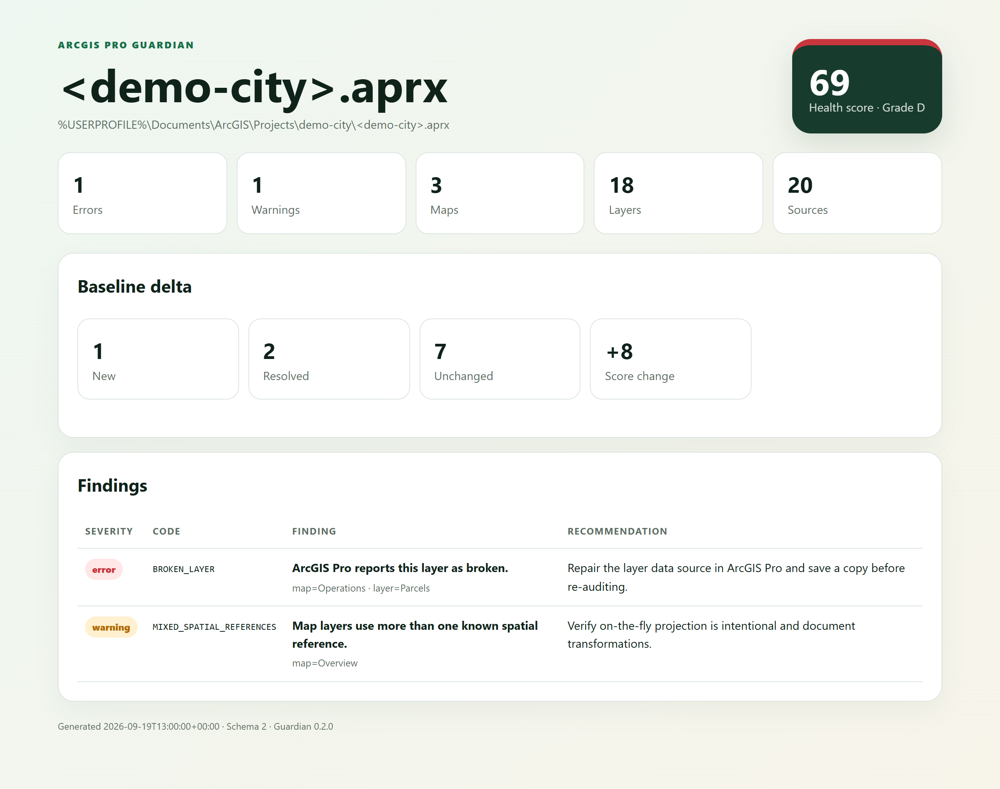

<p align="center">
  
</p>

<h1 align="center">ArcGIS Pro Guardian</h1>

<p align="center"><strong>A local-first release gate for ArcGIS Pro projects.</strong></p>

ArcGIS Pro Guardian audits a saved `.aprx`, turns hidden project risks into stable findings, assigns a 0–100 health score, compares regressions with a baseline, and produces a polished standalone HTML report. It reads project metadata through ArcPy and never saves or rewrites the project.



## Why it exists

ArcGIS automation projects usually focus on running geoprocessing tools or controlling a live Pro session. Guardian focuses on the last mile: proving that a project is healthy, portable, and ready for another person or machine.

## Highlights

| Capability | What you get |
|---|---|
| Project inventory | Maps, layouts, map frames, layers, tables, and data sources |
| Risk detection | Broken items, missing sources, machine-bound paths, duplicate names, unknown and mixed spatial references |
| Policy engine | Per-check severity overrides plus allowed and blocked source roots |
| Health score | 0–100 score, A–F grade, and pass/review/fail status |
| Baseline diff | New, resolved, and unchanged findings with score movement |
| Report formats | Text, JSON, Markdown, and a responsive single-file HTML dashboard |
| Automation | Stable exit codes and ArcPy-free tests that run on GitHub Actions |
| Privacy | Optional user-profile path redaction before sharing reports |

## Quick start

```powershell
$arcgisPython = 'C:\Program Files\ArcGIS\Pro\bin\Python\envs\arcgispro-py3\python.exe'
$guardian = '.\plugins\arcgis-pro-guardian\scripts\arcgis_project_audit.py'

& $arcgisPython $guardian `
  --project 'C:\GIS\Delivery\City.aprx' `
  --format html `
  --output '.\guardian-report.html' `
  --redact-paths
```

Exit codes are designed for automation:

- `0`: the configured threshold passed;
- `1`: findings reached the `--fail-on` threshold;
- `2`: ArcPy, project, baseline, policy, or output failure.

## Use it inside ArcGIS Pro

Guardian also ships as a native Python Toolbox:

`plugins/arcgis-pro-guardian/arcgis/ArcGISProGuardian.pyt`

In ArcGIS Pro, open the Catalog pane, right-click **Toolboxes**, choose **Add Toolbox**, and select that file. The **Audit ArcGIS Pro Project** tool exposes project, report format, policy, baseline, failure threshold, and path-redaction parameters in the standard Geoprocessing pane.

The tool writes the report even when a configured delivery gate fails, so the failure remains diagnosable.

## Save and compare a baseline

```powershell
& $arcgisPython $guardian `
  --project 'C:\GIS\Delivery\City.aprx' `
  --format json `
  --output '.\guardian-baseline.json' `
  --fail-on never

& $arcgisPython $guardian `
  --project 'C:\GIS\Delivery\City.aprx' `
  --baseline '.\guardian-baseline.json' `
  --format markdown `
  --output '.\guardian-delta.md'
```

Finding fingerprints are based on the check code and context, so baseline comparisons remain stable across runs.

## Team policy

Copy [`default-policy.json`](plugins/arcgis-pro-guardian/assets/default-policy.json) and customize only what your delivery process needs:

```json
{
  "checks": {
    "NO_LAYOUTS": "warning",
    "ABSOLUTE_SOURCE_PATH": "error"
  },
  "require_layout": true,
  "allowed_source_roots": ["D:\\PublishedGIS", "\\\\fileserver\\gis"],
  "blocked_source_roots": ["C:\\Users"]
}
```

Then run with `--policy .\guardian-policy.json --fail-on warning`.

Any check can be set to `error`, `warning`, `info`, or `off`. Guardian fails closed on invalid policy or baseline files instead of silently ignoring them.

## Install as a Codex plugin

```powershell
codex plugin marketplace add https://github.com/wanghan7355608/arcgis-pro-guardian
codex plugin add arcgis-pro-guardian@personal
```

The marketplace manifest lives at `.agents/plugins/marketplace.json`.

## Development

The core module has no import-time ArcPy dependency, so policy, scoring, diffing, and rendering tests run anywhere:

```powershell
python -m unittest discover -s tests -v
```

Real `.aprx` audits still require the Python interpreter bundled with ArcGIS Pro.

## Scope and safety

Guardian does not inspect feature rows, contact web services, repair paths, or save projects. Reports may include local and UNC paths; use `--redact-paths` before publishing them.

## License

MIT
