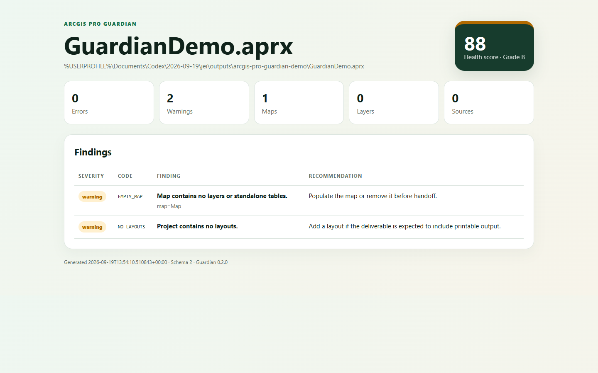
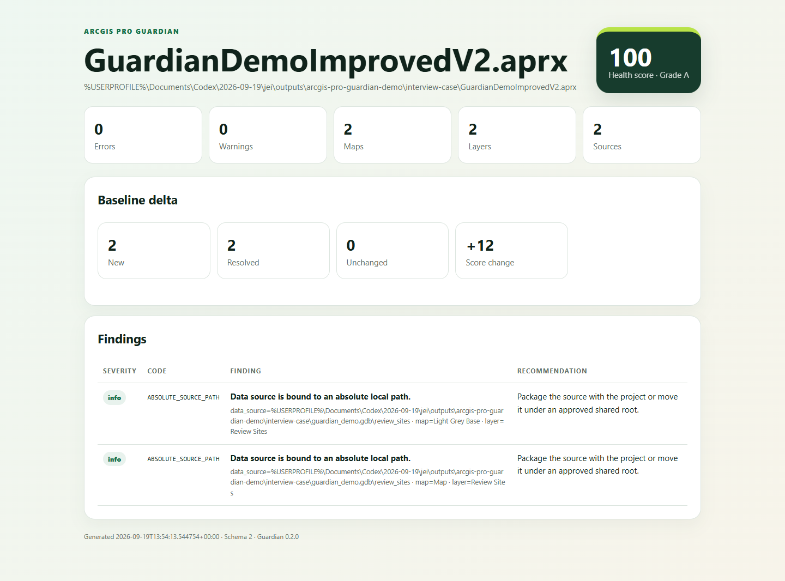

# ArcGIS Pro Guardian 可复现案例

这个案例用两个真实保存的 `.aprx` 文件验证 Guardian 的审计、评分和基线差异能力。样例地理数据是合成的，但报告由 ArcGIS Pro 自带 ArcPy 实际生成，并非手工编写。

## 结果

| 指标 | Before | After |
|---|---:|---:|
| 状态 | review | pass |
| 健康分 | 88 / B | 100 / A |
| 错误 | 0 | 0 |
| 警告 | 2 | 0 |
| 信息 | 0 | 2 |
| 地图 | 1 | 2 |
| 布局 | 0 | 1 |
| 图层 | 0 | 2 |

基线对比结果为：分数提升 12，解决 2 项问题，新增 2 条信息提示，未变化项为 0。

| Before | After |
|---|---|
|  |  |

- [Before HTML 报告](before.html)
- [After HTML 报告](after.html)
- [Before JSON 证据](before.json)
- [After JSON 证据](after.json)
- [本案例策略](interview-policy.json)

## 发生了什么

Before 工程只有一个空地图，没有图层、独立表或布局。Guardian 给出两条警告：

- `EMPTY_MAP`：地图为空；
- `NO_LAYOUTS`：项目缺少布局。

改进过程中并不是一次成功。第一次导入 ArcGIS Pro 官方 A3 布局模板后，模板附带的底图在当前 ArcPy 环境中被识别为未知空间参考，分数降至 82。V2 没有隐藏这个问题，而是移除模板底图，再为两个地图接入明确为 WGS 84 的样例要素类。

最终 After 工程包含两个地图、两个图层和一个布局。原有两条警告被解决，项目从 review 变为 pass。

## 为什么还有两条 info

两个图层都引用本机文件地理数据库，因此默认规则会产生 `ABSOLUTE_SOURCE_PATH`。本案例通过公开的 `interview-policy.json` 将其降为 info，用来表达“本机演示允许，但仍需提示”。

这不是悄悄关闭检查：策略文件与报告一起提交，判断过程可以复核。生产交付时应根据团队环境把该项恢复为 warning 或 error，并配置允许的数据根目录。

## 如何复现

准备一个保存过的 `.aprx` 后，用 ArcGIS Pro 自带 Python 运行：

```powershell
$arcgisPython = 'C:\Program Files\ArcGIS\Pro\bin\Python\envs\arcgispro-py3\python.exe'
$guardian = '.\plugins\arcgis-pro-guardian\scripts\arcgis_project_audit.py'

& $arcgisPython $guardian `
  --project '<before.aprx>' `
  --policy '.\docs\case-study\interview-policy.json' `
  --format json `
  --output '.\before.json' `
  --redact-paths `
  --fail-on never

& $arcgisPython $guardian `
  --project '<after.aprx>' `
  --policy '.\docs\case-study\interview-policy.json' `
  --baseline '.\before.json' `
  --format html `
  --output '.\after.html' `
  --redact-paths `
  --fail-on never
```

## 边界

- Guardian 读取保存状态，不检查 ArcGIS Pro 尚未保存的界面状态。
- 它检查项目结构与数据源元信息，不扫描要素行，也不验证业务数据正确性。
- “数据源缺失”只表示审计机器当时无法解析该地址，不代表数据永久丢失。
- 它默认不修复、不改路径、不保存工程，避免质检工具改变被检对象。
- 本案例在 ArcGIS Pro 3.0.1 的 ArcPy 环境中验证；其他版本仍需单独兼容性测试。
